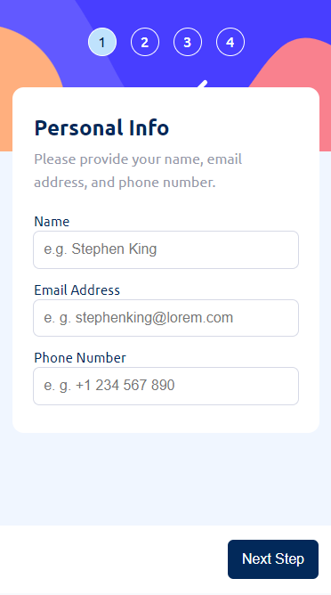

# Frontend Mentor - Multi-step form solution

This is a solution to the [Multi-step form challenge on Frontend Mentor](https://www.frontendmentor.io/challenges/multistep-form-YVAnSdqQBJ). Frontend Mentor challenges help you improve your coding skills by building realistic projects. 

## Table of contents

- [Overview](#overview)
  - [The challenge](#the-challenge)
  - [Screenshot](#screenshot)
  - [Links](#links)
- [My process](#my-process)
  - [Built with](#built-with)
  - [What I learned](#what-i-learned)
  - [Continued development](#continued-development)
  - [Useful resources](#useful-resources)
- [Author](#author)
- [Acknowledgments](#acknowledgments)

## Overview

### The challenge

Users should be able to:

- Complete each step of the sequence
- Go back to a previous step to update their selections
- See a summary of their selections on the final step and confirm their order
- View the optimal layout for the interface depending on their device's screen size
- See hover and focus states for all interactive elements on the page
- Receive form validation messages if:
  - A field has been missed
  - The email address is not formatted correctly
  - A step is submitted, but no selection has been made

### Screenshot

#### Scrennshot for desktop 


#### Screenshot for mobile


### Links

- Solution URL: [View solution on Frontendmentor](https://www.frontendmentor.io/solutions/react-multi-step-form-ua6nbESEzN)
- Live Site URL: [View Live Site](https://multi-step-form27.netlify.app)

## My process

### Built with

- Semantic HTML5 markup
- CSS variables
- Flexbox
- CSS Grid
- Mobile-first workflow
- [React](https://reactjs.org/) - JS library
- [Styled Components](https://styled-components.com/) - For styles

### What I learned

I created some reusable components, e. g. the Button component. In my opinion reusable components make working on these kind of projects much easier because the design is always the same.

```js
import { HeadingElement } from "./Heading.elements"

const Heading = ({ children }) => {
  return (
    <HeadingElement>{children}</HeadingElement>
  )
}

export default Heading
```


### Continued development

Concerning programming I now want to start learning [TypeScript](https://typescriptlang.org) and I think I first use it without ReactJS but later on I want to build it with ReactJS to build larger, more interactive applications. Furthermore, I might consider learning how to design websites because I think it will be fun and it might improve my frontend developing skills.

### Useful resources

- [Form Validation](https://leanylabs.com/blog/form-validation-in-react/) - After a while I got stuck when trying to implement form validation. I was not quite sure how to distinguish between two states: the input field is empty or the data is invalid. This article was really handy.
- [Styled components docs](https://styled-components.com/docs/api) - First I had multiple errors telling me that I should not pass props concerning styling the way I would do it with props to be displayed.
- [AirBnb React Style Guide](https://github.com/airbnb/javascript/tree/master/react) - To improve code readability and make this project easier to maintain I had a look at this style guide.

## Author

- Frontend Mentor - [@LucaJahnen](https://www.frontendmentor.io/profile/LucaJahnen)
- Github - [@LucaJahnen](https://github.com/LucaJahnen)

## Acknowledgments

To get an idea of what I am going to build I first looked for youtube videos. After a while I found this [video](https://www.youtube.com/watch?v=uDCBSnWkuH0&t=511s) by [Web Dev Simplified](https://www.youtube.com/@WebDevSimplified). I did not watch the whole video but it helped me to better understand what I wanted to build.
